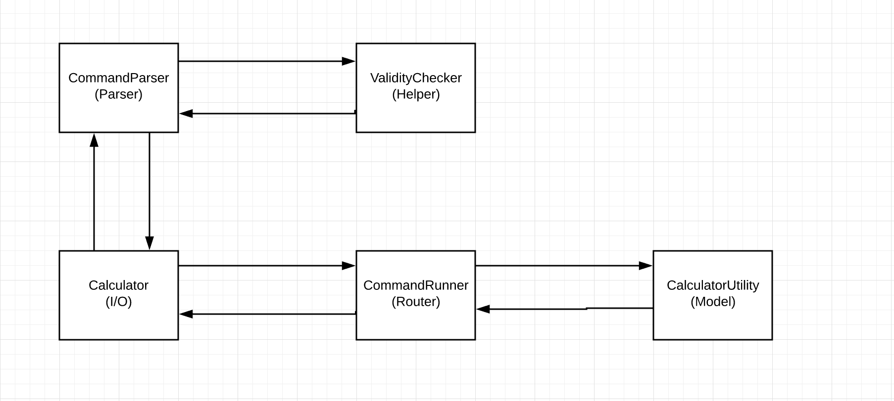

# CalculatorRuby

Problem statement : 
    Model a calulator which accepts add, subtract, multiply, divide, cancel and exit as commands,
    So that I can do basic mathematics.

    Commands look like so

    > add 5
    5.0
    > add 2
    7.0
    > multiply 3
    21.0
    > cancel
    0
    > exit
 
Approach towards the Solution :

    
Steps to run the solution :
    1. Clone the repository.
    2. Open cmd and navigate to the cloned repository.
    3. To run - 
            a. Program do "ruby /lib/calculator.rb"
            b. Tests do "rspec spec spec/calculator_spec.rb"
 

